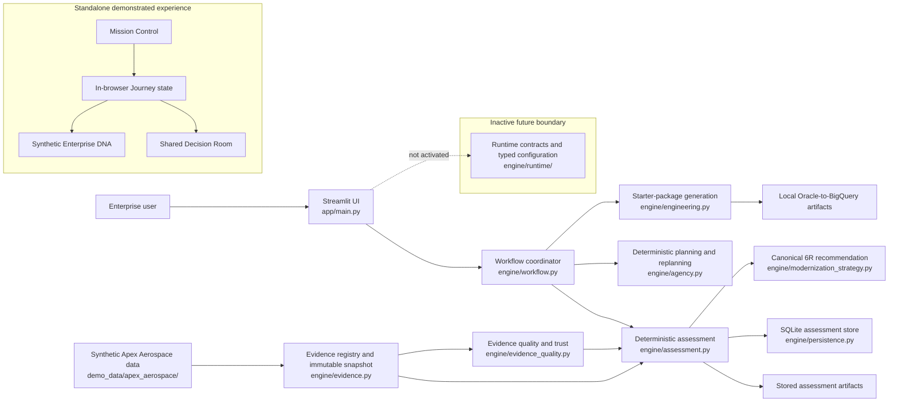

# Modernization AI Lab — EMOS Architecture

Modernization AI Lab is an **Enterprise Modernization Operating System (EMOS)** that turns synthetic enterprise context and evidence into deterministic assessments, governed modernization recommendations, and implementation-ready artifacts. The repository currently contains two distinct product surfaces: an executable Python/Streamlit application and a richer, standalone browser demonstration. They do not share runtime state.

## Capability status

- **Implemented** — executable source code exists in the current Python application path and is protected by repository tests.
- **Demonstrated** — the capability is represented by the deterministic, browser-only Mission Control prototype; it is not connected to the Python backend or durable storage.
- **Future** — contracts, configuration, or documentation may exist, but the capability is not activated in the current application.

## Architecture at a glance



## Major components

| Component | Status | Repository-grounded responsibility |
| --- | --- | --- |
| `app/main.py` | Implemented | Streamlit entry point, session-state UI, evidence and assessment inspection, governed recommendation display, and artifact actions. |
| `engine/workflow.py` | Implemented | Coordinates the current workflow and owns its projections through caller-provided mutable state, normally Streamlit session state. |
| `engine/data_loader.py` and `engine/evidence.py` | Implemented | Load synthetic Apex data, validate the evidence registry, create a deterministic content-addressed snapshot, and reconstruct the assessed portfolio. |
| `engine/evidence_quality.py` | Implemented | Calculates evidence completeness, confidence, freshness, conflicts, blockers, and trust state without changing assessment scores. |
| `engine/assessment.py` and `engine/assessment_models.py` | Implemented | Calculate portfolio scores, select the candidate, assign waves, and produce validated assessment records. |
| `engine/modernization_strategy.py` | Implemented | Produces immutable, evidence-backed canonical 6R recommendations and enforces the no-execution boundary. |
| `engine/persistence.py` | Implemented | Stores versioned assessment inputs, outputs, quality results, recommendation data, and artifact references in SQLite. |
| `engine/agency.py` | Implemented | Provides deterministic specialist planning, constraint handling, replanning, and human-approval status. It is not an autonomous agent runtime. |
| `engine/engineering.py` | Implemented | Generates a local Oracle-to-BigQuery starter package; it does not deploy infrastructure or modify external systems. |
| `prototype/mission-control/` | Demonstrated | Standalone HTML/CSS/JavaScript experience for Mission Control, Enterprise DNA, Guided Journey, Decision Room, validation, and executive views. |
| `engine/runtime/` | Future / inactive | Defines versioned runtime contracts and typed configuration. The package is not connected to application execution. |

## Implemented architecture

### Data and evidence flow

1. The application loads the fictional **Apex Aerospace Manufacturing** portfolio from `demo_data/apex_aerospace/`.
2. `engine/evidence.py` validates a versioned evidence registry and its referenced sources.
3. The evidence content is converted into an immutable, deterministic snapshot with a content-derived `DNA-SNAPSHOT-*` identifier.
4. `engine/evidence_quality.py` evaluates required evidence, freshness, conflicts, completeness, confidence, findings, and blockers. Its trust states include `Blocked`, `NeedsEvidence`, `ReadyWithWarnings`, and `Ready`.
5. `engine/assessment.py` calculates numeric scores from the validated portfolio. Evidence quality is reported alongside the result and does not silently alter those scores.
6. The assessment, evidence versions, snapshot, quality result, findings, recommendation, and artifact references can be persisted by `TrustedAssessmentStore` in SQLite.
7. Streamlit presents the resulting assessment, recommendation, provenance, trust state, workflow state, and generated artifacts from session-local workflow projections.

All enterprise records used by the current product are synthetic.

### Assessment and scoring

Portfolio scoring is deterministic Python logic. For each asset, the assessment derives business value, technical debt, cloud readiness, AI readiness, complexity, migration risk, and normalized cost pressure. The modernization priority score is:

```text
Priority =
    25% Business Value
  + 15% Technical Debt
  + 15% Cloud Readiness
  + 15% AI Readiness
  + 15% Cost Pressure
  -  8% Complexity
  -  7% Migration Risk
```

Supporting calculations include:

- migration risk: `45% complexity + 35% technical debt + 20% business criticality`;
- cost pressure: asset annual cost divided by the maximum annual cost in the portfolio, multiplied by 100;
- deterministic ordering: priority descending, business value descending, then platform name ascending.

Assets recommended for Retain or Retire are excluded from candidate selection. The highest-ranked remaining asset becomes the primary candidate. Wave assignment is also rule-based: Retain and Retire receive no migration wave; qualifying high-priority/lower-risk assets enter Wave 1, priority scores of at least 48 enter Wave 2, and the remainder enter Wave 3.

### Canonical 6R recommendation

The canonical strategy module supports:

- Retain
- Retire
- Rehost
- Replatform
- Refactor
- Repurchase

The older `Replace` label is normalized to `Repurchase` at the canonical boundary. `engine/modernization_strategy.py` produces an immutable per-asset recommendation containing the selected strategy, fit scores, alternatives, rationale, evidence references, findings, confidence, trust state, provenance, and deterministic hashes. The displayed confidence is deterministic evidence confidence, not an LLM probability.

The current Apex happy path selects the Oracle Customer Analytics Warehouse and supports an Oracle-to-BigQuery replatforming starter package.

### Governance and decision controls

The implemented Python path provides governance safeguards around the recommendation:

- recommendation and assessment provenance are separately inspectable;
- evidence blockers and trust state are visible;
- a `Blocked` trust state prevents governed decision progression in the Streamlit experience;
- warning states remain explicit rather than being silently treated as ready;
- specialist planning and replanning remain deterministic and carry a pending-human-approval status;
- assessment and recommendation records retain version and hash references for auditability.

This is a governed recommendation boundary, not a complete production authorization service. The richer multi-specialist Decision Room described below is demonstrated in the standalone prototype.

### Execution boundary

An assessment or recommendation never grants execution authority. `engine/modernization_strategy.require_execution_authority()` raises `ExecutionNotAuthorizedError`, and recommendation records carry no execution authority.

The engineering module generates local implementation artifacts only. It does **not**:

- modify application source repositories;
- provision cloud infrastructure;
- invoke cloud, GitHub, ServiceNow, Jira, or deployment adapters;
- start an autonomous modernization run;
- authorize or execute production changes.

This boundary keeps analysis, human governance, artifact preparation, authorization, and execution conceptually separate.

## Demonstrated architecture

`prototype/mission-control/` is a standalone static product demonstration built with HTML, CSS, and vanilla JavaScript. It runs entirely in the browser using deterministic synthetic data and in-memory state. It has no backend, API, Streamlit dependency, or shared state with the Python application.

| Demonstrated capability | What the prototype shows | Current boundary |
| --- | --- | --- |
| Mission Control | Portfolio, program, case, recommendation, risk, readiness, and executive-oriented projections. | Browser-only deterministic presentation. |
| Enterprise DNA Explorer | Connected synthetic business, application, data, API, infrastructure, ownership, and dependency context. | In-memory sample model; not a durable enterprise graph service. |
| Guided Modernization Journey | Stage, owner, blocker, next action, work objects, validation, and roadmap progression. | Scripted state machine for the guided experience. |
| Shared Decision Room | Specialist positions, a human constraint, decision resolution, propagation, approvals, and lineage. | Demonstrated governance interaction; not the Python persistence or authorization path. |
| AI Agency presence | Specialist roles, handoffs, and work cues around the modernization case. | Deterministic scripted behavior; no live LLM or autonomous agent execution. |

The prototype demonstrates how EMOS work could remain synchronized across executive, specialist, engineering, validation, and roadmap views. That synchronization is local to the browser experience and must not be interpreted as a deployed enterprise runtime.

## Future architecture

The following capabilities are not active in the current product:

- activation of `engine/runtime/` contracts and configuration as the application execution boundary;
- durable workflow recovery, checkpoints, queues, workers, or distributed orchestration;
- production tenant isolation, identity enforcement, authorization, secrets management, and policy enforcement;
- server-side durable Decision Room records and enterprise approval services;
- live model routing or autonomous multi-agent execution;
- enterprise connectors and cloud, repository, ticketing, infrastructure, or deployment adapters;
- production observability, availability engineering, scaling, and operational controls.

These are future implementation concerns, not claims about the current repository. Their presence in specifications or inactive contracts does not make them implemented.

## State and ownership boundaries

- **Python application state:** `engine/workflow.py` remains the behavior and workflow-state owner. The active state is session-local when supplied by Streamlit.
- **Stored assessment evidence:** SQLite and generated files retain assessment/evidence/artifact records, but they do not provide durable workflow recovery.
- **Browser prototype state:** the standalone Mission Control experience owns its own in-memory JavaScript state and reset behavior.
- **Enterprise DNA demonstration:** supplies contextual relationships to the browser experience; it is not the workflow-state owner.
- **Runtime Spine:** contracts and typed configuration exist but remain inactive and do not own current behavior.

## Architectural invariants

1. Enterprise data in the repository and public demonstration is synthetic.
2. Numeric assessment and 6R outputs are calculated by deterministic rules.
3. AI-oriented explanations or specialist representations must not invent numeric scores or imply live execution.
4. Evidence quality and trust are explicit and traceable.
5. High-risk or blocked decisions require human governance.
6. Generated packages are artifacts, not execution mandates.
7. Runtime contracts remain inactive until an approved implementation slice connects them.

## Repository evidence map

- Product direction: `design/00_PRODUCT_CONSTITUTION.md`
- Streamlit entry point: `app/main.py`
- Workflow ownership: `engine/workflow.py`
- Assessment logic: `engine/assessment.py`
- Evidence and trust: `engine/evidence.py`, `engine/evidence_quality.py`
- Canonical 6R intelligence: `engine/modernization_strategy.py`
- Persistence: `engine/persistence.py`
- Deterministic agency behavior: `engine/agency.py`
- Artifact generation: `engine/engineering.py`
- Inactive runtime boundary: `engine/runtime/`
- Standalone demonstration: `prototype/mission-control/`
- Behavioral evidence: `tests/` and `prototype/mission-control/tests/`
