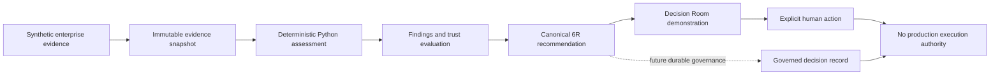

# EMOS Product and Architecture Decisions

This register summarizes the major product and architecture decisions that shape the Enterprise Modernization Operating System (EMOS). It is grounded in the current repository and distinguishes shipped engine behavior from the deterministic browser demonstration and from future production architecture.

## Status Vocabulary

| Status | Meaning |
|---|---|
| **Implemented** | Supported by current Python source and automated tests. |
| **Demonstrated** | Represented in the standalone Mission Control prototype using deterministic, session-local browser state. |
| **Future** | A documented product or architecture direction that is not active in the current execution path. |

Architecture records document decisions; they do not by themselves prove implementation or authorize a new feature. See the [ADR guidance](docs/adr/README.md) and the [Product Constitution](design/00_PRODUCT_CONSTITUTION.md).

## Decision Summary

| ID | Decision | Current status |
|---|---|---|
| DEC-001 | Calculate modernization scores deterministically in Python | Implemented |
| DEC-002 | Build recommendations from immutable, versioned evidence | Implemented |
| DEC-003 | Treat canonical 6R output as a recommendation, not a governed decision | Implemented |
| DEC-004 | Use trust state to qualify or block progression without rewriting scores | Implemented; richer gates demonstrated |
| DEC-005 | Keep high-risk approval as an explicit human action | Partially implemented; demonstrated in Mission Control |
| DEC-006 | Preserve immutable assessment and recommendation history | Implemented; durable governed decision records are future |
| DEC-007 | Keep recommendation, approval, authorization, and execution as separate boundaries | Implemented at recommendation boundary; later boundaries are future |
| DEC-008 | Use a deterministic synthetic enterprise for the public experience | Implemented and demonstrated |
| DEC-009 | Constrain AI to explanation and collaboration, with a deterministic fallback | Implemented as product rule; public demo is scripted |

## Decision Flow

## DEC-001 — Deterministic Scoring in Python

**Decision:** All numeric modernization scores and rule-based recommendations are calculated by Python. An LLM may explain an outcome, but it must not invent or alter a score.

**Status:** Implemented.

**Rationale:** Enterprise decisions must be reproducible, testable, and explainable. Keeping calculations in explicit code prevents model variability from changing portfolio priorities or risk signals.

**Consequences:**

- Business value, technical debt, cloud readiness, AI readiness, complexity, migration risk, cost pressure, and modernization priority use explicit formulas.
- Candidate selection is deterministic for the same validated inputs.
- Changes to scoring logic require source changes and regression tests rather than prompt changes.
- AI-generated prose cannot become the source of numeric truth.

**Repository evidence:** [assessment engine](engine/assessment.py), [assessment models](engine/assessment_models.py), [assessment tests](tests/test_assessment.py), and [6R reference tests](tests/test_6r_reference_scenarios.py).

## DEC-002 — Evidence-Backed Recommendations

**Decision:** Every trusted assessment and recommendation must reference the exact evidence snapshot, assessment definition, criterion results, findings, and artifact versions from which it was produced.

**Status:** Implemented.

**Rationale:** A modernization recommendation is useful only when an enterprise can inspect why it was made, which evidence supported it, and whether that evidence remains current and internally consistent.

**Consequences:**

- Evidence is strictly validated, canonically ordered, hashed, and assembled into immutable snapshots.
- Recommendation rationale and supporting evidence identifiers are separately inspectable.
- Snapshot, assessment, recommendation, and artifact references are stored transactionally in SQLite.
- Missing, stale, or conflicting evidence remains visible instead of being silently filled by an AI model.

**Repository evidence:** [evidence model](engine/evidence.py), [evidence-quality rules](engine/evidence_quality.py), [transactional persistence](engine/persistence.py), [assessment models](engine/assessment_models.py), and the [6R-01 completion evidence](work_results/6R-01-result.md).

## DEC-003 — Canonical 6R Recommendation Boundary

**Decision:** EMOS uses the canonical six strategies **Retain, Retire, Rehost, Replatform, Refactor, and Repurchase**. The legacy label `Replace` is accepted only as an inbound compatibility alias and is normalized to `Repurchase`. A 6R result is a recommendation, not an approval or execution instruction.

**Status:** Implemented.

**Rationale:** A stable vocabulary makes recommendations comparable across assets while preserving backward compatibility. Separating recommendation from governance prevents an analytical result from becoming an unauthorized enterprise action.

**Consequences:**

- Each assessed asset receives one versioned recommendation with all six strategies represented as the selected strategy plus alternatives.
- The recommendation authority is `RecommendOnly`.
- The recommendation execution authority is `None`.
- Recommendation records do not approve, authorize, or start modernization work.

**Repository evidence:** [canonical 6R ADR](docs/adr/0001-canonical-6r-recommendation-boundary.md), [strategy model](engine/modernization_strategy.py), [recommendation models](engine/assessment_models.py), [strategy tests](tests/test_modernization_strategy.py), and [6R-01 results](work_results/6R-01-result.md).

## DEC-004 — Trust Qualifies Progression, Not Scores

**Decision:** Trust is evaluated from evidence completeness, freshness, conflicts, and sufficiency. Trust may qualify or block progression, but it must not rewrite deterministic numeric scores or the underlying assessment recommendation.

**Status:** Implemented in the assessment engine; richer workflow gates are demonstrated in the browser prototype.

**Rationale:** Business urgency and evidence confidence answer different questions. A high-priority asset can still have insufficient or conflicting evidence. Preserving both signals prevents false certainty.

**Consequences:**

- The evidence layer distinguishes `Ready`, `ReadyWithWarnings`, `NeedsEvidence`, and `Blocked`.
- Recommendation records expose the corresponding `Ready`, `Warning`, or `Blocked` trust state.
- Conflicting blocking evidence yields `Blocked`; missing or stale blocking evidence yields `NeedsEvidence`.
- A blocked recommendation remains inspectable but does not silently become an approved decision.

**Repository evidence:** [evidence-quality engine](engine/evidence_quality.py), [recommendation contract](engine/assessment_models.py), [evidence-quality tests](tests/test_evidence_quality.py), and the Apex scenario in [6R-01 results](work_results/6R-01-result.md).

## DEC-005 — Explicit Human Approval for High-Risk Decisions

**Decision:** High-risk progression requires a visible human decision. AI specialists prepare evidence, analysis, and recommendations; they do not self-approve enterprise actions.

**Status:** Partially implemented and demonstrated. The shared workflow exposes a pending-human-approval state, and Mission Control demonstrates explicit approvals. Production identity, authorization, and durable approval services are future work.

**Rationale:** Accountability for high-impact modernization choices must remain with an identifiable human owner. This keeps assistance distinct from authority and makes disagreement, constraints, and overrides auditable.

**Consequences:**

- The workflow can project `Pending Human Approval` rather than treating analysis completion as consent.
- Mission Control requires deliberate user actions for decision resolution, revised-plan approval, correction approval, and wave approval.
- Demonstrated approvals are deterministic and session-local; they are not evidence of production authorization enforcement.
- Future approval records must bind identity, role, rationale, evidence version, and decision version.

**Repository evidence:** [agency approval projection](engine/agency.py), [workflow state](engine/workflow.py), [Mission Control interactions](prototype/mission-control/script.js), and the [Product Constitution](design/00_PRODUCT_CONSTITUTION.md).

## DEC-006 — Immutable History and Additive Records

**Decision:** Assessment evidence, criterion results, findings, recommendations, and artifact references are immutable, versioned records. Later actions must add records or events rather than overwrite prior analytical truth.

**Status:** Implemented for the assessment and recommendation boundary. The browser prototype demonstrates decision records, but a production-grade durable governed-decision ledger is future work.

**Rationale:** Enterprises need to reconstruct what was known, recommended, and decided at a point in time. Mutation would erase provenance and make stale or conflicting actions difficult to detect.

**Consequences:**

- Trusted assessment models are frozen and reject unsupported fields.
- Content hashes and version references make stored bundles verifiable.
- SQLite persistence adds records transactionally and enforces recommendation uniqueness by run, asset, and version.
- A future governed decision must preserve the assessment recommendation and add review, approval, or authorization records without changing it.

**Repository evidence:** [immutable assessment models](engine/assessment_models.py), [SQLite persistence](engine/persistence.py), [workflow persistence tests](tests/test_workflow.py), [canonical 6R ADR](docs/adr/0001-canonical-6r-recommendation-boundary.md), and [program decision projections](prototype/mission-control/program-intelligence.js).

## DEC-007 — Execution Authority Is a Separate Boundary

**Decision:** Recommendation, human review, governed approval, execution authorization, and execution are distinct controls. The current trusted recommendation does not grant execution authority and cannot trigger deployment or infrastructure changes.

**Status:** Implemented at the recommendation boundary. Durable approval, authorization, adapters, and production execution are future capabilities. The Runtime Spine remains outside the active application execution path.

**Rationale:** Analytical confidence does not imply permission to act. Separating these boundaries prevents a recommendation—or a demonstration label—from being mistaken for an executable mandate.

**Consequences:**

- Current recommendation records explicitly carry `execution_authority="None"`.
- The public prototype makes no live cloud, source-control, enterprise-system, model, or deployment calls.
- Browser labels such as wave approval or authorization are product demonstrations, not production credentials or runtime authority.
- Later execution work must consume an explicit, validated authorization record and still must not bypass external platform controls.

**Repository evidence:** [recommendation contract](engine/assessment_models.py), [execution-boundary tests](tests/test_modernization_strategy.py), [6R-01 completion evidence](work_results/6R-01-result.md), and [Runtime Spine contracts](engine/runtime/contracts.py).

## DEC-008 — Synthetic Sample Enterprise

**Decision:** The public and automated demonstration uses the fictional Apex Aerospace Manufacturing enterprise. Its inventory, relationships, evidence, scores, recommendations, and journey outcomes are deterministic and synthetic.

**Status:** Implemented and demonstrated.

**Rationale:** A connected, realistic sample lets judges and prospective users experience the product without exposing private enterprise information, requiring integrations, or producing non-repeatable results.

**Consequences:**

- The sample is validated as a connected Enterprise DNA graph rather than generated randomly.
- The same input produces the same portfolio, candidate ranking, trust findings, and journey state.
- The Apex golden path selects Oracle Customer Analytics Warehouse and recommends Replatform.
- Sample loading and browser journey state are local to the demonstration and are not evidence of enterprise-scale ingestion or durable multi-tenant operation.

**Repository evidence:** [sample experience controller](prototype/mission-control/sample-portfolio-ui.js), [sample package](prototype/mission-control/samples/enterprise/), [sample tests](prototype/mission-control/tests/synthetic-sample-portfolio.test.js), and the [synthetic sample completion report](work_results/SYNTHETIC-SAMPLE-PORTFOLIO-result.md).

## DEC-009 — AI Assistance With Deterministic Fallback

**Decision:** AI specialists may explain, synthesize, and collaborate around governed work objects, but deterministic code remains the source of facts, scores, validation outcomes, and state transitions. The application must retain a working path without a live model call.

**Status:** Implemented as an architectural and product constraint. The public Mission Control experience uses deterministic scripted specialist behavior and does not invoke a live LLM or Codex runtime.

**Rationale:** The product must remain demonstrable, testable, and safe when a provider is unavailable. Provider output should increase comprehension without becoming an unverified source of enterprise truth.

**Consequences:**

- Numeric assessment and validation continue without an OpenAI call.
- Public-demo specialist collaboration is accurately described as deterministic simulation.
- Future model adapters must consume bounded evidence and return proposals that remain subject to validation and human governance.
- Provider selection must not alter the canonical enterprise records or authority boundaries.

**Repository evidence:** [Product Constitution](design/00_PRODUCT_CONSTITUTION.md), [agency module](engine/agency.py), [assessment engine](engine/assessment.py), and [Mission Control implementation](prototype/mission-control/script.js).

## Current Boundary

The repository currently provides deterministic evidence ingestion, scoring, trusted assessment records, canonical 6R recommendations, SQLite persistence, and a rich browser-based governance demonstration. It does **not** yet provide production identity enforcement, durable multi-tenant decision approval, execution authorization, autonomous modernization, cloud deployment, or production operations. Those remain future capabilities and must preserve the decisions above when implemented.
