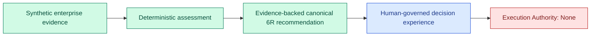

# Modernization AI Lab — Hackathon MVP

> **Modernization AI Lab is an Enterprise Modernization Operating System (EMOS) that turns enterprise evidence into explainable assessments, canonical 6R recommendations, and human-governed modernization decisions.**

[Launch the public demo](https://modernization-ai-lab-emos.jeasom.workers.dev/)

The hackathon experience uses the fictional **Apex Aerospace Manufacturing** enterprise and synthetic data only. It demonstrates a narrow, deterministic, and auditable modernization journey. It does not claim that the broader EMOS vision is already implemented.

## MVP Boundary at a Glance

| Capability | Status | What the repository supports |
|---|---|---|
| Evidence | **Implemented** | Versioned synthetic evidence, evidence references, completeness/conflict signals, and stored artifacts. |
| Assessment | **Implemented** | Deterministic Python scoring and assessment records derived from evidence. |
| 6R Recommendation | **Implemented** | Immutable, evidence-backed recommendation records across Retain, Retire, Rehost, Replatform, Refactor, and Repurchase. |
| Governed Decision | **Demonstrated** | The browser-based Shared Decision Room demonstrates human review, decision gates, blockers, and lineage. It is not a production authorization service. |
| Portfolio Planning | **Future** | Enterprise-scale sequencing, capacity-aware wave optimization, and durable portfolio governance are not implemented. |
| Agentic Execution | **Future** | No autonomous agent is authorized to change source code, infrastructure, or enterprise systems. |
| Deployment | **Future** | No production cloud or deployment adapter is activated by the public experience. |
| Benefit Realization | **Future** | Realized-value measurement against production outcomes is not implemented. |
| Continuous Learning | **Future** | No production feedback loop updates models or policies from customer outcomes. |

## What EMOS Demonstrates Today

### 1. Evidence

EMOS begins with evidence rather than an unconstrained AI conversation.

- The scenario uses synthetic enterprise, portfolio, dependency, risk, and technical-health data.
- Evidence is attached to the assessed asset and represented with explicit references and versions.
- Missing and conflicting evidence remains visible instead of being silently filled in.
- Assessment and recommendation artifacts retain provenance needed for later inspection.

### 2. Assessment

The assessment layer converts evidence into reproducible modernization signals.

- Numeric scores are calculated deterministically in Python.
- The same accepted evidence produces the same assessment outcome.
- Evidence completeness and conflicts influence confidence and trust state.
- Assessment records remain separately inspectable from recommendations and human decisions.

The AI role is explanatory: AI-assisted language may explain a result, but it does not invent the numeric scores that determine it. The application can operate without a live OpenAI call by using deterministic fallback behavior.

### 3. Canonical 6R Recommendation

The implemented recommendation boundary compares the canonical strategies:

- **Retain**
- **Retire**
- **Rehost**
- **Replatform**
- **Refactor**
- **Repurchase** (with `Replace` retained only as a compatibility alias where documented)

Each recommendation preserves the selected strategy, alternatives, rationale, confidence, trust state, evidence references, assessment reference, version information, and stable identifiers/hashes. The recommendation authority is explicitly limited to **Recommend Only**.

### 4. Governed Decision

Mission Control and the Shared Decision Room demonstrate how enterprise users can inspect a recommendation before allowing work to progress.

- Human decision gates remain visible.
- Evidence blockers and trust state remain visible during review.
- Recommendation, decision position, and lineage are presented as distinct concepts.
- High-risk or blocked conditions do not silently become execution authority.

This is a **demonstrated product interaction**, not a claim of a production-ready approval, authorization, identity, or policy-enforcement service. The persistent Python recommendation boundary ends with:

> **Execution Authority = None**

## Apex Aerospace Golden Scenario

| Field | Demonstrated result |
|---|---|
| Enterprise | Apex Aerospace Manufacturing |
| Asset | Oracle Customer Analytics Warehouse |
| Evidence | Synthetic, versioned portfolio and modernization evidence |
| Recommended 6R | Replatform |
| Target shown by the MVP | Oracle-to-BigQuery modernization starter path |
| Recommendation confidence | 0.585 in the recorded 6R validation evidence |
| Trust state | Blocked |
| Evidence condition | Three missing and two conflicting evidence items in the recorded scenario |
| Human governance | Required before progression |
| Execution authority | None |

The value of the scenario is not that every modernization activity is automated. It is that the platform makes the recommendation, supporting evidence, uncertainty, and governance boundary inspectable before any execution is permitted.

## Three-Minute Judge Experience

1. Open the [live demo](https://modernization-ai-lab-emos.jeasom.workers.dev/).
2. Select **Try Sample Enterprise**.
3. Review the **Executive Engagement Brief**, then choose **Enter Mission Control**.
4. Use the highlighted **Immediate Next Action** in the Guided Modernization Journey.
5. Inspect the Customer Intelligence case, its evidence state, dependencies, owner, blocker, and next action.
6. Continue to assessment and inspect why the Oracle Customer Analytics Warehouse is prioritized.
7. Review the canonical 6R recommendation, confidence, alternatives, and trust blockers.
8. Enter the Shared Decision Room and observe the explicit human governance interaction and decision lineage.
9. Confirm that a recommendation or governed decision does not silently grant execution authority.

The public experience is a deterministic browser-based prototype. Specialist collaboration and generated artifact contents shown there are scripted or mocked unless explicitly identified as Python-backed behavior.

## Broader EMOS Vision

The full product vision extends beyond the current hackathon boundary:

```mermaid
flowchart LR
    A["Evidence"] --> B["Assessment"]
    B --> C["6R Recommendation"]
    C --> D["Governed Decision"]
    D -. future .-> E["Portfolio Planning"]
    E -. future .-> F["Agentic Execution"]
    F -. future .-> G["Deployment"]
    G -. future .-> H["Benefit Realization"]
    H -. future .-> I["Continuous Learning"]

    classDef current fill:#d1fae5,stroke:#047857,color:#064e3b
    classDef demonstrated fill:#dbeafe,stroke:#1d4ed8,color:#1e3a8a
    classDef future fill:#f3f4f6,stroke:#6b7280,color:#374151,stroke-dasharray:5 5
    class A,B,C current
    class D demonstrated
    class E,F,G,H,I future
```

### Future Capability Intent

| Future capability | Intended business outcome | Not claimed today |
|---|---|---|
| Portfolio Planning | Sequence modernization investments across dependencies, capacity, risk, and business value. | No production portfolio optimizer or enterprise-scale wave scheduler. |
| Agentic Execution | Coordinate bounded specialists under explicit policy and human authority. | No autonomous source-code or infrastructure modification. |
| Deployment | Orchestrate approved changes through external delivery platforms and cloud adapters. | No live GitHub, CI/CD, Terraform, ServiceNow, Jira, or cloud deployment action. |
| Benefit Realization | Compare expected value with measurable operational and business outcomes. | No production telemetry or financial realization ledger. |
| Continuous Learning | Improve recommendations using governed outcome feedback and policy-approved learning. | No live model training, policy adaptation, or customer-data learning loop. |

These capabilities are architectural and product direction. They remain subject to future implementation, enterprise controls, security review, reliability engineering, and customer validation.

## Trust and Execution Boundary

The MVP deliberately separates intelligence from authority:

1. Evidence informs an assessment.
2. The assessment informs a recommendation.
3. A person inspects and governs the decision.
4. Recommendation and decision records do not themselves authorize execution.
5. Execution must fail closed until a future, explicit authority boundary is implemented and satisfied.

The Runtime Spine contracts present in the repository remain inactive and do not operate the current application workflow.

## Validation Evidence

The recorded 6R completion evidence reports:

- **159 Python tests passed**.
- **10 JavaScript suites passed**.
- Deterministic recommendation identity, hashing, immutability, persistence, evidence mismatch, stale evidence, invalidation, and execution-boundary behavior were covered.
- Browser, responsive, accessibility, syntax, dependency, credential, private-path, and clean-checkout checks were recorded for the completed slice.

See [the 6R-01 completion evidence](work_results/6R-01-result.md) for the exact commands, test inventory, and known limitations. These are recorded project results, not a claim of independently certified production readiness.

## Honest Technology Attribution

- **Implemented Python behavior:** deterministic assessment/scoring, 6R comparison, confidence/trust derivation, stable identifiers and hashes, persistence, artifact generation, and fail-closed execution checks.
- **Demonstrated browser behavior:** Mission Control, Enterprise DNA exploration, Guided Journey, specialist collaboration, Shared Decision Room, validation, and executive views.
- **AI-assisted behavior:** explanations and specialist narratives where enabled; deterministic fallback preserves the demo without a live model call.
- **Not active in the public build:** live LLM execution, Codex execution, enterprise connectors, cloud deployment, autonomous modernization, and production authorization.

## Known Limitations

- The public experience uses only synthetic data and a bounded sample enterprise.
- The browser prototype stores experience state locally rather than providing durable, multi-tenant production workflow recovery.
- Governed decision interactions demonstrate the intended operating model but do not constitute production identity, authorization, or policy enforcement.
- The current implementation does not deploy workloads or change customer systems.
- Portfolio-scale planning, realized-value measurement, and continuous learning remain future capabilities.

## Supporting Documentation

- [README and judge guide](README.md)
- [Repository-grounded architecture](ARCHITECTURE.md)
- [Product and architecture decisions](DECISIONS.md)
- [Canonical 6R boundary ADR](docs/adr/0001-canonical-6r-recommendation-boundary.md)
- [6R implementation evidence](work_results/6R-01-result.md)
