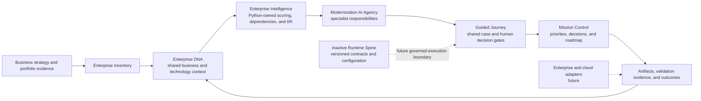

# Modernization AI Lab

> **An Enterprise Modernization Operating System (EMOS) that transforms enterprise strategy and evidence into governed modernization decisions and outcomes.**

## [Launch Live Demo →](https://modernization-ai-lab-emos.jeasom.workers.dev/)

**No installation or sign-in required.** The public experience uses a fictional Apex Aerospace enterprise and synthetic data only.

> **Demo transparency:** The public Mission Control experience is a deterministic, browser-based product prototype. Portfolio scoring, canonical 6R recommendations, workflow transitions, and validation outcomes follow explicit rules. AI-specialist collaboration is represented by deterministic scripted responses; generated artifact contents are mocked. The public build does not make live LLM, Codex, cloud, or enterprise-system calls.

## Three-Minute Judge Experience

Target duration: approximately **2 minutes 45 seconds**.

1. Open the [live demo](https://modernization-ai-lab-emos.jeasom.workers.dev/).
2. Select **Try Sample Enterprise**.
3. Review the **Executive Engagement Brief**, then select **Enter Mission Control**.
4. In **Guided Modernization Journey**, follow the highlighted **Immediate Next Action** in this order:
   1. **Continue to Assessment**
   2. **Inspect Customer Intelligence Capability**
   3. **Assess as One Initiative**
   4. **Continue to Decision Room**
   5. **Start Workspace Flow**
   6. **Assemble Decision Positions**
   7. **Resolve Decision**
   8. **Yes — protect finance reports for six months**
   9. **Propagate Constraint**
   10. **Approve Revised Plan**
   11. **Continue to Engineering Workspace**
   12. **Generate Migration Starter Package**
   13. **Assemble Package**
   14. **Continue to Validation Workspace**
   15. **Run Independent Validation**
   16. **Investigate Failure**
   17. **Approve Correction and Rerun**
   18. **Rerun Impacted Validation**
   19. **Continue to Executive Workspace**
   20. **Prepare Executive Roadmap**
   21. **Approve Wave 1**
   22. **Inspect Decision Lineage**
5. Observe how the same modernization case stays synchronized across Mission Control, specialist workspaces, evidence, decisions, validation, and the executive roadmap.

The sample-enterprise route intentionally prepares portfolio discovery before entering Mission Control so the judge reaches the decision journey quickly. To inspect the unverified starting state, use **Full Reset**, open **Mission Control**, and select **Begin Portfolio Discovery**.

## The Business Problem

Enterprise modernization is usually fragmented across portfolio spreadsheets, architecture repositories, consulting reports, engineering tools, and governance meetings. Leaders can see activity, but struggle to answer five connected questions: **What should change, why now, what evidence supports it, who must decide, and what outcome will result?**

## The Differentiated Solution

Modernization AI Lab treats modernization as a continuous enterprise operating discipline rather than a one-time application migration. It connects business strategy, Enterprise DNA, deterministic intelligence, specialist responsibilities, evidence, human decision gates, engineering work objects, validation, and executive outcomes in one traceable journey.

The primary object is the **modernization case**, not a chat conversation. Specialists enrich and reason around shared work objects while the user acts as **Mission Commander** and retains decision authority.

## Capability Overview

| Capability | What it contributes |
|---|---|
| **Mission Control** | Turns portfolio evidence into executive health, priority, readiness, recommendation, and decision views. |
| **Enterprise DNA** | Connects strategy, initiatives, capabilities, products, applications, data, APIs, infrastructure, teams, risks, and outcomes as shared enterprise context. |
| **Enterprise Intelligence** | Applies deterministic scoring, dependency analysis, evidence confidence, canonical 6R reasoning, and recommendation logic. |
| **Modernization AI Agency** | Assigns specialist responsibilities for discovery, architecture, value, risk, planning, engineering, validation, and executive advice. |
| **Guided Modernization Journey** | Keeps the current stage, owner, blocker, evidence, work object, and next action visible across the engagement. |
| **Trust and Governance** | Preserves evidence lineage, explicit human decisions, immutable decision history, approval boundaries, and visible trust states. |
| **Canonical 6R Intelligence** | Evaluates Retain, Retire, Rehost, Replatform, Refactor, and Replace using shared deterministic criteria. |

## Implemented, Demonstrated, and Future

| Product area | Implemented and test-protected | Demonstrated in the public experience | Future target |
|---|---|---|---|
| Portfolio intelligence | Python-owned scoring, prioritization, evidence confidence, dependency checks, and canonical 6R recommendation logic | Synthetic portfolio discovery and candidate selection | Connected enterprise inventory sources and continuous refresh |
| Enterprise DNA | Versioned domain foundation and a connected, navigable sample-enterprise model | Business-to-technology context, dependency exploration, and modernization impact navigation | Durable, customer-specific enterprise operating model enriched from approved sources |
| Mission Control | Responsive browser state, case synchronization, decision views, reset behavior, and accessibility controls | Executive Decision Center for the Apex Aerospace engagement | Multi-tenant portfolio operations with governed customer data |
| AI Agency | Specialist roles, deterministic orchestration, fallback behavior, and responsibility boundaries | Visible specialist collaboration around shared cases and work objects | Provider-agnostic live model routing with evaluated, policy-controlled assistance |
| Guided Journey | Shared workflow state, human gates, decision propagation, artifact references, and reset/invalidation behavior | Discovery through assessment, decision, engineering, validation, roadmap, and wave approval | Durable recovery and enterprise workflow integration |
| Governance | Evidence-bound decisions and explicit review/approval/authorization boundaries in the Python domain | Trust blockers, human resolution, decision lineage, and approval cues | Enterprise identity, authorization policy, audit export, and regulatory controls |
| Engineering and validation | Deterministic starter-package and validation-domain behavior with stored artifacts in the Python application | Mocked package contents plus an intentional validation failure and governed correction | Authorized adapters to engineering, cloud, ITSM, and delivery platforms |
| Runtime Spine | Versioned contracts and typed configuration exist as inactive foundations | Not activated or represented as live execution | Durable execution, recovery, tenancy, policy enforcement, and observability after approval |

“Demonstrated” means an interactive, deterministic product simulation; it does not imply a live external integration or autonomous execution.

## Architecture at a Glance



## Hackathon Judging Guide

These are common hackathon evaluation themes, not a claim about any organizer's official rubric.

| Likely criterion | What to inspect |
|---|---|
| **Business impact** | The Executive Engagement Brief, Mission Control priorities, business outcomes, and the approved modernization wave. |
| **Product differentiation** | Enterprise DNA as shared context, modernization cases as primary work objects, and coordinated specialist responsibilities instead of a chatbot. |
| **Technical execution** | Deterministic Python scoring, canonical 6R logic, synchronized browser state, stored artifacts, and regression evidence. |
| **Responsible AI and trust** | Synthetic-data disclosure, separation of deterministic and AI-assisted behavior, evidence blockers, human decision gates, and no implied execution authority. |
| **User experience** | The uninterrupted three-minute route, persistent navigation, Guided Journey orientation, responsive layout, keyboard support, and reduced-motion behavior. |
| **Scalability of the idea** | The provider-agnostic Enterprise DNA, agency, workflow, contract, and adapter boundaries—clearly separated from the capabilities implemented today. |

## Validation Evidence

The latest recorded product checkpoint includes:

- **159 Python tests passed**.
- **10 JavaScript suites passed**.
- Focused canonical 6R validation: **13 tests passed**.
- Python syntax compilation and dependency checks passed.
- Credential-pattern and private-path scans passed.
- Streamlit health check returned `ok`.
- Browser, keyboard, accessibility, reduced-motion, responsive, reset, and public-demo regression paths were exercised.
- The repository working tree was clean at checkpoint `036d88d` before this README-only presentation update.

Detailed evidence is recorded in [the canonical 6R completion report](work_results/6R-01-result.md), the [prototype validation history](prototype/mission-control/README.md), and other reports under [`work_results/`](work_results/).

## Public Demo

**URL:** [https://modernization-ai-lab-emos.jeasom.workers.dev/](https://modernization-ai-lab-emos.jeasom.workers.dev/)

The public deployment serves the standalone Mission Control prototype from [`prototype/mission-control/`](prototype/mission-control/). It requires no backend, API key, account, or installation. State is browser-local and all enterprise data is synthetic.

## Local Launch

### Standalone Mission Control prototype

```bash
python3 -m http.server 8080 --directory prototype/mission-control
```

Open [http://localhost:8080/](http://localhost:8080/).

### Python and Streamlit application

Requirements: Python 3.10 or later.

```bash
python3 -m venv .venv
source .venv/bin/activate
pip install -r requirements.txt
streamlit run app/main.py
```

The Streamlit application runs the deterministic Python assessment and artifact workflow. It can operate without an OpenAI API key by using its deterministic fallback.

## Technology and Attribution

- **Python, Streamlit, Pandas, Pydantic, SQLite, and Pytest** power the assessment, workflow, evidence, decision, persistence, and validation domains.
- **HTML5, CSS3, vanilla JavaScript, and inline SVG** power the publicly hosted Mission Control prototype.
- Numeric scoring and canonical 6R calculations are owned by deterministic Python logic; an LLM may explain results but must not invent scores.
- The public demo does **not** execute GPT, Codex, cloud migrations, infrastructure changes, source-code modernization, or deployment operations.
- OpenAI/Codex influenced the engineering workflow and product development, but the public experience is deterministic and does not present scripted behavior as live model execution.

## Limitations

- The hosted experience is a visual and interaction prototype, not a production multi-tenant service.
- All organizations, systems, costs, risks, volumes, recommendations, and artifacts are synthetic.
- Public portfolio import is browser-local, bounded to ten modernization units, and does not ingest repositories, documents, diagrams, source code, or enterprise connectors.
- Engineering package contents in the browser demo are mocked; deep modernization of arbitrary uploads requires representative SQL, schema, source, or engineering metadata.
- External systems and cloud platforms are represented as future adapter boundaries; no deployment is initiated.
- Runtime Spine contracts and typed configuration are intentionally inactive. Durable recovery, tenant enforcement, policy enforcement, production observability, and managed execution remain future work.

## Documentation and Project History

- [Product Constitution](design/00_PRODUCT_CONSTITUTION.md)
- [Engineering workspace](docs/engineering/README.md)
- [Current product-state assessment](docs/production-readiness/CURRENT_PRODUCT_STATE.md)
- [Mission Control implementation and validation history](prototype/mission-control/README.md)
- [Work results and completion evidence](work_results/)

<details>
<summary>Earlier implementation milestones</summary>

### Sprint 1: Portfolio Intelligence

- Loaded and validated the Apex Aerospace Manufacturing portfolio.
- Calculated business value, technical debt, cloud readiness, AI readiness, risk, and composite modernization scores.
- Ranked assets and selected Oracle Customer Analytics Warehouse as the recommended candidate.

### Engagement 2: Decision and Planning

- Added 6R recommendation, value analysis, risk assessment, architecture recommendation, target blueprint, and wave plan.
- Preserved deterministic calculations and explicit human approval boundaries.

### Engagement 3: Implementation Preparation

- Added factory readiness, migration design, target schema, SQL translation examples, validation plans, lineage, reconciliation rules, cutover planning, rollback planning, and implementation sequencing.

### Engagement 4: AI Agency Operations

- Added specialist ownership, evidence and decision lineage, confidence escalation, decision memos, reusable patterns, operational telemetry, replay-oriented events, and portfolio-level delivery views.

</details>
