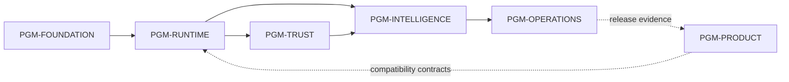

# EMOS Engineering Backlog

## Purpose and authority

This is the portfolio view from programs to releasable slices. It references,
but does not replace, the detailed Production Candidate backlog in
[`17_ENGINEERING_BACKLOG.md`](../enterprise-runtime-foundation/17_ENGINEERING_BACKLOG.md)
or the Runtime Spine plan in
[`020_RUNTIME_SPINE_IMPLEMENTATION_PLAN.md`](../enterprise-runtime-foundation/020_RUNTIME_SPINE_IMPLEMENTATION_PLAN.md).

An item is not authorized because it appears here. The applicable PRS, ARB gate,
Definition of Ready, dependencies, and review remain mandatory.

## Hierarchy

| Program | Outcome | Epics | Feature groups | Releasable slices |
|---|---|---|---|---|
| PGM-FOUNDATION — Engineering Integrity | Reproducible, governed delivery | Governance and Contracts; Qualification | Authority routing, baseline QA, change/release evidence | `BASE-01`, RS-01, RS-02, RS-03, RS-24 |
| PGM-RUNTIME — Runtime Spine | One journey executes durably without UI redesign | Compatibility Boundary; Durable Runtime Spine | Contracts/config, compatibility seam, state, artifacts, queue, recovery | RS-01–RS-24 |
| PGM-TRUST — Trust and Control | Tenant-scoped, authorized, auditable execution | Trust Boundary | Identity, tenant, policy, approval, audit, secrets | Detailed slices require an approved implementation plan |
| PGM-INTELLIGENCE — Governed Intelligence | Evidence-grounded model/tool execution | Governed AI Execution | DNA snapshots, context, model adapter, tools, content defense | Detailed slices require an approved implementation plan |
| PGM-OPERATIONS — Operable Candidate | Observable, recoverable, releasable bounded service | Operable Candidate | Telemetry, SLOs, runbooks, restore, performance, cost, release | Runtime RS-22–RS-24 plus later approved operating slices |
| PGM-PRODUCT — EMOS Experience | Preserve and evolve Mission Control, Journey, Agency, and Enterprise DNA | Product epics are governed by separate PRSs | Existing verified product capability and future customer outcomes | No new product slice is authorized by this foundation packet |

## Program dependency

## Epic and feature traceability

| Epic | Program | Feature group | Detailed authority |
|---|---|---|---|
| EPIC-00 Governance and Contracts | PGM-FOUNDATION | State, tenant, workflow, risk, data, reliability, operations contracts | Backlog M0 |
| EPIC-01 Compatibility Boundary | PGM-RUNTIME | Regression baseline, runtime contracts, configuration, compatibility adapter | RS-01–RS-04 |
| EPIC-02 Durable Runtime Spine | PGM-RUNTIME | Durable state, snapshots, artifacts, queue, idempotency, checkpoints, recovery | RS-05–RS-20 |
| EPIC-03 Trust Boundary | PGM-TRUST | OIDC, tenant isolation, policy, approval, audit, secrets | Backlog M3; implementation plan not yet decomposed |
| EPIC-04 Governed AI Execution | PGM-INTELLIGENCE | Model, context, tool, and content-defense adapters | Backlog M4; implementation plan not yet decomposed |
| EPIC-05 Operable Candidate | PGM-OPERATIONS | Telemetry, SLO, recovery, capacity, cost, release | Backlog M5 and RS-21–RS-24 where applicable |
| EPIC-06 Qualification | PGM-FOUNDATION | Evidence package and ARB decision | Backlog M6 and RS-24 |

## Backlog rules

- Deliver one independently testable slice at a time.
- Preserve one workflow owner and the deterministic local path.
- Do not pull Trust, Operations, or product scope into a Runtime slice.
- Split implementation and architecture migration when they have different rollback.
- A slice leaves the repository releasable; incomplete paths stay inactive.
- Release scope is composed only from Complete slices in the release registry.
