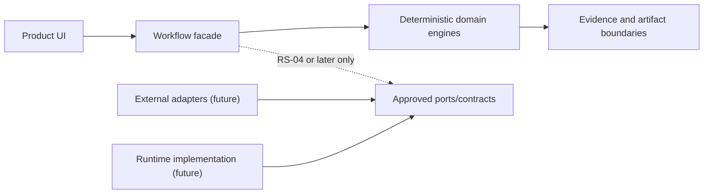

# Repository Organization and Ownership Boundaries

## Decision

Keep the current physical source layout. Moving working modules now would add
regression risk without creating product value. Establish logical ownership and
dependency rules first; reorganize only through a separately approved slice when
measured coupling justifies it.

## Current structure

| Path | Classification | Responsibility | Owner boundary |
|---|---|---|---|
| `app/` | Source | Streamlit presentation and user-event handling | Product UI |
| `engine/` | Source | Deterministic domain calculations, workflow facade, agency, artifacts | Product/domain engineering |
| `engine/runtime/` | Source, inactive | Versioned Runtime Spine contracts and typed configuration | Runtime engineering |
| `prototype/mission-control/` | Source, standalone prototype | Mission Control, HQ, Enterprise DNA explorer, guided interactions | Product prototype |
| `demo_data/` | Synthetic fixtures | Demo enterprise inputs and evidence registries | Product/data |
| `tests/` | Test source | Python unit, integration, characterization, and contract tests | QA with module owners |
| `prototype/mission-control/tests/` | Test source | JavaScript behavior and regression suites | Product QA |
| `design/` | Governing product/specification docs | Constitution and product specifications | Product/architecture |
| `docs/` | Architecture and engineering docs | Decisions, plans, registries, readiness | Architecture/engineering |
| `work_packets/` | Delivery input | Approved implementation packet definitions | TPM/engineering |
| `work_results/` | Evidence | Immutable-by-convention completion reports | Implementer and reviewers |
| `evaluations/` | Evaluation assets | Repeatable quality/evaluation inputs | QA/AI evaluation |
| `generated_packages/` | Generated runtime artifacts | Local assessment, implementation, and replan output | Runtime-generated; not source |

## Recommended logical module boundaries

These are dependency rules, not instructions to create directories immediately.

| Boundary | May own | Must not own |
|---|---|---|
| Presentation (`app`) | Rendering, input collection, navigation, accessibility | Scoring, workflow truth, persistence rules |
| Product workflow (`engine.workflow`) | Current transitions, invalidation, orchestration facade | UI rendering, provider SDKs, future durable runtime internals |
| Domain engines (`assessment`, `engineering`, `agency`) | Deterministic business rules and domain results | Streamlit state, authentication, queue delivery |
| Evidence/persistence | Evidence models, provenance, artifact transactions | UI decisions, workflow transitions, provider selection |
| Runtime contracts (`engine.runtime`) | Versioned commands, queries, envelopes, configuration | Product behavior until an approved adapter slice activates it |
| Adapters (future, only when needed) | Provider or storage translation | Business rules, canonical domain state |
| Operations (future) | Deployment, telemetry, runbooks, release controls | Domain truth or approval decisions |

## Dependency direction



Domain modules do not import presentation modules. Provider adapters depend on
domain-defined ports; domain code does not import provider SDK types. Shared
state has one owner and is passed or queried explicitly.

## Package rules

- Prefer cohesive modules over generic `utils`, `common`, or `shared` packages.
- Add a package only when it has a stable responsibility, owner, tests, and
  dependency direction.
- Do not extract microservices from logical modules for Production Candidate v1.
- Keep provider-specific adapters at the repository edge.
- Use explicit public exports sparingly; `engine/__init__.py` is a compatibility
  facade, not a catalogue of every internal symbol.
- Generated output never becomes source input implicitly.

## Documentation structure

```text
docs/
  architecture/   navigation and current/target boundaries
  runtime/        runtime authority routing
  engineering/    standards, workflow, metrics, templates
  adr/            one immutable decision per file
  backlog/        program hierarchy and slice registry
  roadmap/        dependency and horizon views
  releases/       releases composed from slices
  enterprise-runtime-foundation/  existing architecture authorities
  production-readiness/           point-in-time assessments
work_results/     implementation and validation evidence
```

## Reorganization triggers

A physical move requires an ADR when it changes public imports, state ownership,
persistence boundaries, runtime activation, deployment units, or more than one
product surface. A move should have import-compatibility tests and be delivered
separately from behavior changes.
