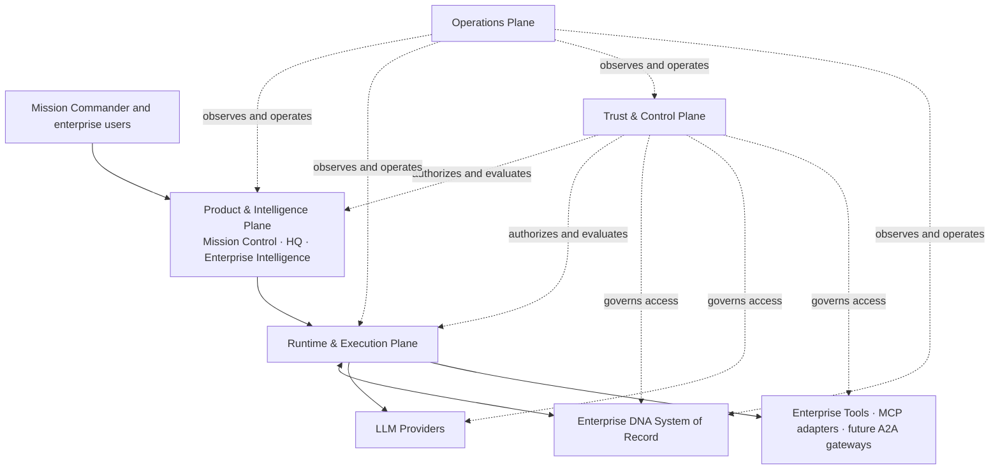

# Enterprise Runtime Foundation — Runtime Architecture

**Status:** Proposed architecture
**Scope:** Enterprise Runtime, Trust, and Operations planes
**Governing inputs:** Product Constitution, Event Schema, Current Product State
**Implementation status:** Design only

## 1. Architectural objective

The Enterprise Runtime Foundation turns Modernization AI Lab from two local,
deterministic product surfaces into a governable enterprise platform without
moving product rules into models or replacing the Modernization Case as the
shared work object.

The existing Product & Intelligence Plane remains above three new platform
planes:

1. **Runtime & Execution Plane** — durably executes cases, agents, tools, and
   checkpoints.
2. **Trust & Control Plane** — authorizes every consequential action and
   maintains evidence, confidence, approval, and audit integrity.
3. **Operations Plane** — keeps the platform observable, reliable, scalable,
   cost-controlled, and recoverable.

## 2. Non-negotiable invariants

1. Enterprise DNA is authoritative for confirmed enterprise facts and
   relationships; it is not workflow state.
2. The Workflow Engine owns execution state; models, tools, and UI surfaces do
   not.
3. Numeric scores and policy outcomes are deterministic, versioned functions.
4. Model output is untrusted until schema, evidence, policy, and validation
   checks succeed.
5. Every external side effect is authorized, idempotent, attributable, and
   auditable.
6. High-risk decisions require an authenticated human approval bound to the
   exact evidence and proposed action.
7. Provider adapters are replaceable. No provider-specific identifier becomes
   a domain primary key.
8. Tenant identity is carried through every request, event, query, artifact,
   trace, and policy decision.
9. Degraded operation is explicit. Deterministic fallback never pretends to be
   live model reasoning.
10. Mission Control and HQ are projections of shared state, never independent
    sources of truth.

## 3. System context

## 4. Runtime & Execution Plane

### Purpose

Execute modernization work durably across sessions, agents, models, tools, and
human gates while preserving replayable state and bounded side effects.

### Responsibilities

- Create and execute versioned workflow definitions.
- Schedule specialist agents and parallel work safely.
- Assemble evidence-grounded context from Enterprise DNA and case artifacts.
- Route model, skill, and tool requests through governed adapters.
- Persist sessions, checkpoints, memory, outputs, and side-effect receipts.
- Pause at policy or human approval gates.
- Recover from transient failures without duplicating external effects.

### Major components

| Component | Responsibility | Authoritative state |
|---|---|---|
| Workflow Engine | Durable orchestration, timers, compensation, task lifecycle | Workflow run and task state |
| Context Engine | Builds bounded, versioned context packages | Context manifests and source references |
| Session Engine | User/agent continuity and active-case binding | Session metadata, not domain facts |
| Checkpoint Engine | Safe recovery boundaries and resumable snapshots | Checkpoint manifests |
| Model Router | Policy-aware provider/model selection and fallback | Routing decisions and model receipts |
| Skill Router | Resolves versioned specialist capability contracts | Skill selection receipts |
| Tool Router | Authorizes and invokes tools through adapters | Invocation intent and outcome receipts |
| Memory Service | Stores scoped working, episodic, and approved durable memory | Memory records with provenance and TTL |
| Queue Manager | Admission control, prioritization, backpressure, DLQ | Queue metadata and delivery state |
| Artifact Service | Stores versioned immutable outputs and manifests | Artifact metadata and object references |
| Agent Runtime | Executes bounded specialist tasks | Ephemeral execution plus task result |

### Interactions

1. Product submits a versioned `StartWorkflow` command with tenant, case,
   actor, workflow definition, and idempotency key.
2. Trust Plane authenticates the actor and returns an authorization decision.
3. Workflow Engine persists the run, emits an outbox event, and schedules work.
4. Context Engine reads an authorized Enterprise DNA snapshot and case evidence.
5. Routers select skills, models, and tools after policy evaluation.
6. Results pass schema, evidence, confidence, and policy checks.
7. Checkpoint Engine commits state before the workflow advances.
8. Product receives state projections; Operations receives telemetry.

### Inputs

- authenticated commands;
- workflow and skill versions;
- Modernization Case references;
- Enterprise DNA snapshot identifiers;
- evidence and artifact references;
- policy decisions and human approvals;
- provider/tool capabilities and health.

### Outputs

- durable workflow/task state;
- artifacts and evidence links;
- model/tool invocation receipts;
- checkpoints and resumable sessions;
- events conforming to a versioned evolution of `EVENT_SCHEMA.md`;
- UI projections and operational telemetry.

### State management

- Relational transactional store: workflows, tasks, sessions, approvals,
  idempotency records, metadata, outbox.
- Versioned object store: artifacts, large context packages, model/tool receipts.
- Cache: non-authoritative hot context, routing data, leases, rate limits.
- Durable queue/workflow service: timers and at-least-once task delivery.
- Enterprise DNA store: separate authority, queried by immutable snapshot ID.

### Failure modes and recovery

| Failure | Recovery |
|---|---|
| Provider timeout/rate limit | bounded retry, circuit breaker, alternate route, deterministic fallback |
| Worker loss | lease expiry and replay from last committed checkpoint |
| Duplicate delivery | idempotency record returns prior outcome |
| Tool partial side effect | receipt inspection, reconciliation, compensating action or human escalation |
| Stale DNA/context | reject version mismatch and rebuild context |
| Policy service unavailable | fail closed for side effects; cached deny-by-default decisions for reads only where approved |
| Queue overload | admission control, priority fairness, backpressure, shed optional work |
| Human approval timeout | pause durably, notify, expire according to policy |

### Dependencies

Trust decisions, Enterprise DNA APIs, durable storage, queue/workflow service,
artifact storage, provider/tool adapters, and Operations telemetry.

### Extensibility

All extensions register versioned capability manifests. Future MCP servers are
tool adapters. Future A2A participants are remote agent adapters with the same
identity, policy, evidence, checkpoint, and audit contracts as local agents.

## 5. Trust & Control Plane

### Purpose

Ensure every actor, model, context item, tool call, artifact, and approval is
authorized, attributable, evidence-grounded, and reviewable.

### Responsibilities

- Federated user and workload identity.
- Tenant isolation and least-privilege authorization.
- Policy evaluation before context access, model use, tool invocation, memory
  write, artifact publication, and workflow transition.
- Prompt-injection and untrusted-content controls.
- Human approval and segregation of duties.
- Evidence integrity, confidence calculation, trust scoring, and audit.
- Runtime protection, secrets, data classification, redaction, and egress rules.

### Major components

Identity Broker, Workload Identity, Authorization Service, Policy Engine,
Runtime Protection Gateway, Prompt/Content Defense, Tool Authorization Service,
Human Approval Service, Evidence Engine, Confidence Engine, Trust Score Service,
Immutable Audit Ledger, Key/Secret Service, and Data Classification Service.

### Interactions

Trust is invoked at command admission and every sensitive transition. It
returns a signed decision containing subject, tenant, resource, action,
conditions, policy version, expiry, and decision ID. Runtime must attach that ID
to downstream events and receipts.

### Inputs

Identity claims, workload attestations, requested action, tenant/resource
attributes, data classifications, context provenance, model/tool risk, evidence
coverage, confidence results, and prior approvals.

### Outputs

Permit/deny/permit-with-conditions decisions, redacted context, approval
requests, trust scores, signed evidence manifests, security alerts, and
append-only audit events.

### State management

- Identity source remains the enterprise IdP.
- Policies are versioned and promoted as code.
- Approval records and audit events are append-only.
- Evidence manifests are immutable; corrections create new versions.
- Trust scores store formula version and component values.

### Failure modes and recovery

Trust failures default to deny for writes and external side effects. Emergency
break-glass access is time-bound, independently approved, highly visible, and
fully audited. Audit-write failure blocks consequential actions rather than
creating unaudited state.

### Dependencies and extensibility

Enterprise IdP, key/secret service, policy repository, audit storage, security
monitoring, and data catalog. New providers/tools must ship risk metadata,
required scopes, data handling declarations, and revocation behavior.

## 6. Operations Plane

### Purpose

Operate the platform against explicit availability, latency, security, cost,
and recovery objectives.

### Responsibilities

- Service health, telemetry, dashboards, alerting, incident response, and SLOs.
- Deployment, configuration, feature flags, and safe rollback.
- Capacity, autoscaling, rate limits, quotas, and cost attribution.
- Backup, restore, failover, disaster recovery, and resilience testing.
- Provider/tool health and dependency risk management.
- AIOps recommendations with human-controlled operational changes.

### Major components

API/edge health layer, OpenTelemetry Collectors, log/metric/trace backends,
alert manager, SLO service, deployment controller, configuration/feature flag
service, capacity controller, cost pipeline, backup/restore service, incident
management integration, runbook automation, and security operations feeds.

### Interactions

Every service emits correlated telemetry. Operations builds golden-signal and
business-flow views, enforces deployment health gates, controls capacity, and
initiates recovery. Operational automation may diagnose and recommend; changes
to security, data, or workflow behavior require authorized human action.

### Inputs and outputs

Inputs include telemetry, audit signals, deployment metadata, quotas, provider
health, cost/usage records, and business KPIs. Outputs include alerts, SLO/error
budgets, scaling decisions, incident records, capacity forecasts, cost reports,
rollback/failover actions, and readiness evidence.

### State management

Telemetry stores are not domain systems of record. Operational configuration is
versioned, deployment state is declarative, incident records are durable, and
backup catalogs record recovery points and restore validation.

### Failure modes and recovery

Collector failure uses local buffering with strict limits; telemetry loss must
not stop ordinary reads but must block releases when observability gates are
unknown. Control-plane failure preserves running workloads. Alert storms are
controlled by deduplication, inhibition, and dependency-aware grouping.

### Dependencies and extensibility

Cloud/container runtime, DNS/load balancing, regional managed storage,
telemetry backends, incident/paging system, and cost exports. The initial
topology may use managed containers; Kubernetes is an option only when tenancy,
scale, or portability requirements justify its operational cost.

## 7. Data consistency model

- Workflow transitions: strongly consistent transaction plus outbox.
- Audit: append-only, at-least-once ingest with event-level deduplication.
- UI projections: eventually consistent and monotonic by sequence number.
- Enterprise DNA: snapshot-consistent reads; optimistic concurrency for writes.
- Artifacts: immutable content-addressed versions.
- Memory: scope-specific consistency; durable memory requires explicit commit.
- Telemetry: best effort with bounded buffering; never authoritative.

## 8. Reference deployment posture

Start with a modular monolith for control APIs plus isolated durable workers,
not dozens of microservices. Separate only boundaries with distinct scaling or
security needs: workflow workers, model gateway, tool gateway, Enterprise DNA,
artifact storage, audit, and telemetry collection.

Use managed regional services wherever they satisfy portability and control
requirements. Establish a second-region recovery environment before claiming
enterprise production readiness. Multi-region active/active is not the default;
it is introduced only for a contracted availability tier that justifies global
consistency complexity.

## 9. Explicit non-goals for the foundation

- General autonomous agents without bounded mandates.
- Model-controlled policy or numeric scoring.
- Unrestricted tool or network access.
- Storing raw prompts, secrets, or sensitive context in logs by default.
- Full event sourcing for every domain object.
- Premature Kubernetes, graph-database, or service-mesh mandates.
- Cross-tenant memory or evidence reuse.
