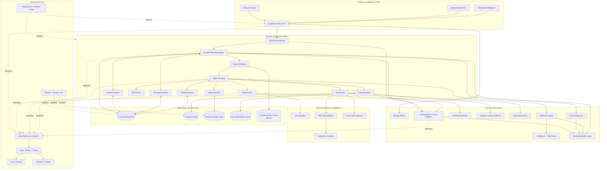
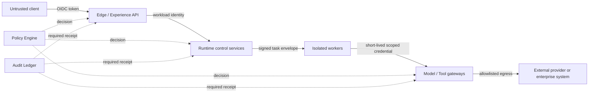

# Enterprise Runtime Foundation — Component Diagram

**Status:** Proposed architecture
**Implementation status:** Design only

## 1. Logical component model

## 2. Trust boundaries

Trust boundaries are crossed only through authenticated APIs or signed task
envelopes. Workers never receive broad tenant credentials. Model and tool
gateways enforce egress, data classification, quotas, and audit independently
of agent instructions.

## 3. Deployment units

The logical diagram does not require one service per box. Initial deployment
units should be:

1. Experience API and control API.
2. Durable Workflow Engine and Queue Manager using a managed workflow/queue
   capability.
3. General agent workers plus isolated high-risk tool workers.
4. Model Gateway.
5. Tool Gateway with MCP/A2A adapter boundary.
6. Enterprise DNA API and storage.
7. Trust services: policy, approval, evidence/confidence, audit.
8. OpenTelemetry Collector tier.

Session, Context, Checkpoint, Skill, and Memory modules may begin inside the
control/runtime services and separate only when scaling, security, or ownership
evidence requires it.

## 4. Dependency rules

- Product components may call Experience APIs, never storage directly.
- Agent Runtime may request context but may not query Enterprise DNA directly.
- Tool and Model Routers are the only permitted external execution paths.
- Trust Plane must not depend on model output to authorize a request.
- Operations may observe all planes but cannot mutate domain state outside a
  versioned recovery or deployment procedure.
- Audit receives facts from all planes and exposes read-only evidence APIs.
- Cache loss cannot cause domain or approval loss.

## 5. Technology selection boundaries

Required capabilities, not mandated products:

- PostgreSQL-compatible transactional semantics with tenant isolation.
- Durable workflow/timer execution and at-least-once task delivery.
- Versioned, encrypted object storage.
- Bounded cache and distributed rate limiting.
- OpenTelemetry-compatible instrumentation and collection.
- Enterprise OIDC/SAML federation and workload identity.
- Versioned policy-as-code evaluation.

Graph-specific storage, Kubernetes, service mesh, and multi-region active/active
remain optional decisions gated by measured need.
