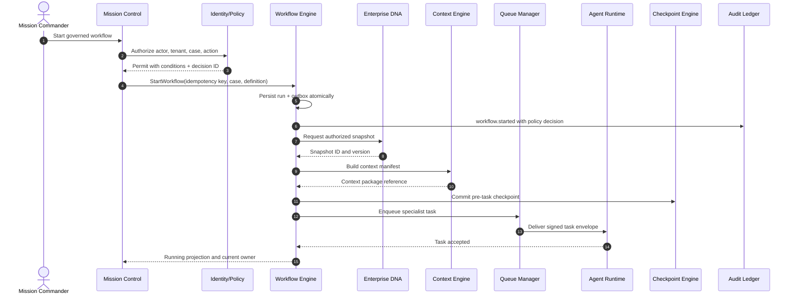
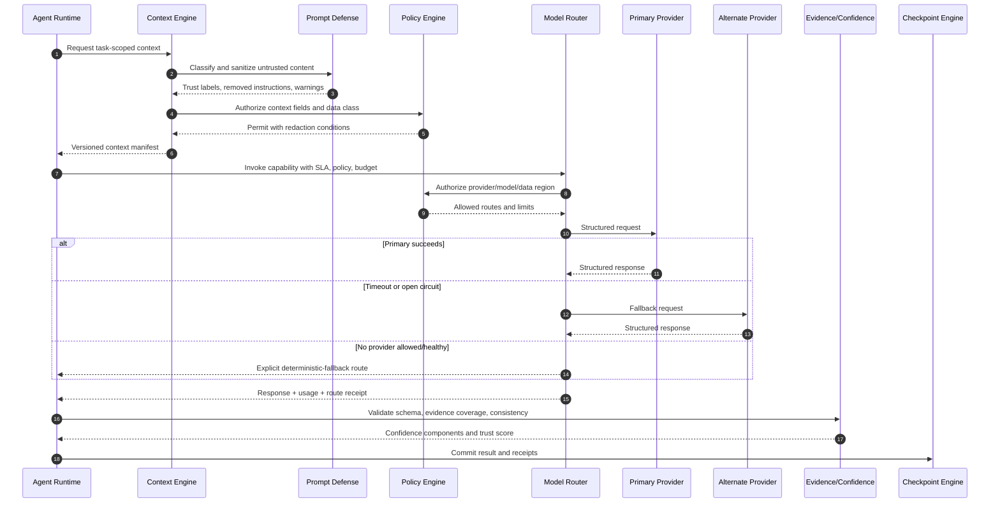
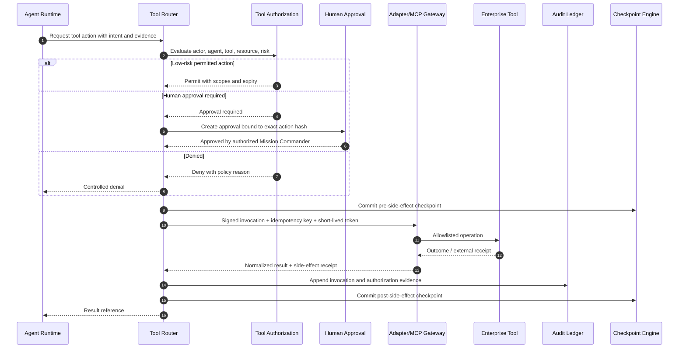
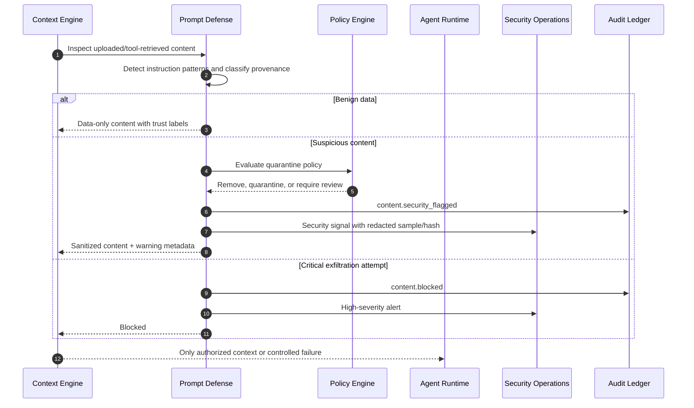
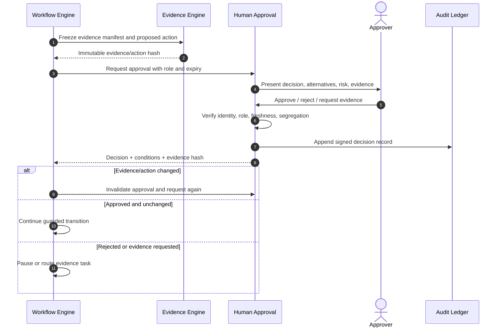
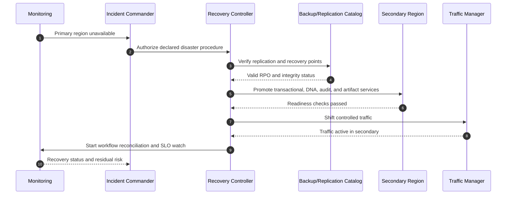

# Enterprise Runtime Foundation — Sequence Diagrams

**Status:** Proposed architecture
**Implementation status:** Design only

## 1. Start a modernization workflow



## 2. Agent reasoning with model routing



## 3. Governed tool invocation



## 4. Prompt-injection detection



## 5. Checkpoint recovery after worker failure

```mermaid
sequenceDiagram
  autonumber
  participant WF as Workflow Engine
  participant Q as Queue Manager
  participant W1 as Worker 1
  participant CP as Checkpoint Engine
  participant W2 as Worker 2
  participant AU as Audit Ledger

  WF->>CP: Load last committed checkpoint
  WF->>Q: Dispatch task with attempt and idempotency key
  Q->>W1: Lease task
  W1->>CP: Record progress before side effect
  W1--xQ: Worker terminates
  Q->>WF: Lease expired
  WF->>AU: task.retry_scheduled
  WF->>CP: Reconcile side-effect receipts
  alt No side effect committed
    WF->>Q: Redispatch same task
  else Side effect already committed
    WF->>WF: Reuse receipt; skip duplicate invocation
  else Outcome uncertain
    WF->>WF: Pause and create reconciliation task
  end
  Q->>W2: Deliver recovered task
  W2->>CP: Resume from checkpoint
  W2-->>WF: Complete with prior/new receipt
```

## 6. Human approval with evidence binding



## 7. Session recovery

```mermaid
sequenceDiagram
  autonumber
  actor User
  participant UI as Mission Control
  participant SE as Session Engine
  participant WF as Workflow Engine
  participant CP as Checkpoint Engine
  participant PE as Policy Engine

  User->>UI: Resume active case
  UI->>SE: ResumeSession(session token)
  SE->>PE: Re-authorize user, tenant, case
  PE-->>SE: Permit with current conditions
  SE->>WF: Load active run projection
  WF->>CP: Resolve latest valid checkpoint
  CP-->>WF: State sequence and pending action
  WF-->>SE: Current stage, owner, blocker, next action
  SE-->>UI: Rehydrated projection; no workflow replay
```

## 8. Disaster recovery promotion


