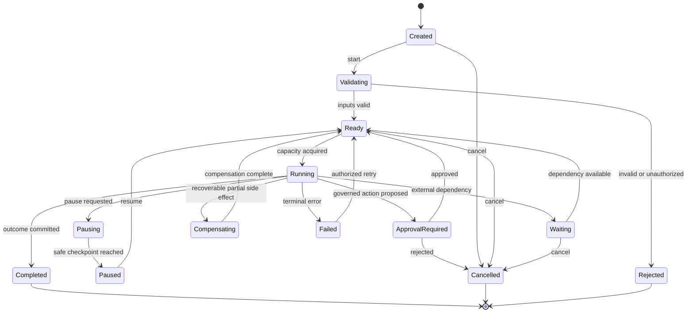

# Runtime State Model

## Status

Proposed target-state contract. This document does not change the current V1.3 state machine.

## Design Goals

- Resume long-running work after process, provider, or regional failure.
- Preserve one authoritative state owner for every datum.
- Make every side effect idempotent, attributable, and auditable.
- Bind decisions and approvals to the evidence actually reviewed.
- Keep Enterprise DNA authoritative for enterprise facts while workflows use immutable snapshots.
- Isolate every tenant, case, session, workflow, and agent execution.

## Identity Hierarchy

| Identifier | Scope | Created by | Immutable |
|---|---|---|---|
| `tenant_id` | Customer security boundary | Tenant service | Yes |
| `subject_id` | Human or workload identity | Identity provider | Yes |
| `case_id` | Modernization case | Product plane | Yes |
| `session_id` | User interaction continuity | Session service | Yes |
| `workflow_id` | Orchestrated journey instance | Workflow control API | Yes |
| `run_id` | One workflow execution attempt | Orchestrator | Yes |
| `task_id` | Durable workflow task | Orchestrator | Yes |
| `agent_run_id` | Specialist execution | Agent runtime | Yes |
| `model_request_id` | Model invocation | Model gateway | Yes |
| `tool_invocation_id` | Tool side effect | Tool gateway | Yes |
| `evidence_id` | Versioned evidence item | Evidence service | Yes |
| `approval_id` | Human authorization | Approval service | Yes |
| `dna_snapshot_id` | Consistent Enterprise DNA view | DNA service | Yes |

All records include `tenant_id`; database keys and authorization checks must not infer it from client-provided object IDs.

## Authoritative Stores

| State | System of record | Consistency |
|---|---|---|
| Business strategy, capabilities, products, dependencies | Enterprise DNA | Versioned authoritative facts |
| Case definition and product-visible status | Product data store | Transactional |
| Workflow state, task leases, checkpoints | Workflow store | Transactional, durable |
| Evidence and generated artifacts | Object store plus metadata store | Immutable versions |
| Approval request and decision | Trust store | Transactional, append-only decision history |
| Audit history | Audit ledger | Append-only, tamper-evident |
| Session preferences and navigation | Session store | Recoverable, bounded TTL |
| Agent working memory | Memory service | Scoped and policy-governed |
| Cache and search indexes | Derived stores | Rebuildable, never authoritative |

## Workflow Aggregate

```text
WorkflowInstance
  workflow_id, tenant_id, case_id, definition_version
  state, state_version, priority, created_by
  dna_snapshot_id, policy_snapshot_id
  current_stage, current_owner, next_action
  checkpoint_ref, evidence_manifest_hash
  created_at, updated_at, completed_at
```

Commands use optimistic concurrency with `expected_state_version`. A successful command updates the aggregate and writes an outbox event in the same transaction.

## Workflow State Machine



`Paused` is reached only after the current atomic transition finishes and a checkpoint is durable. Cancellation cannot erase evidence, audit history, or completed external effects.

## Task State Machine

`Pending -> Leased -> Running -> Succeeded | RetryableFailure | TerminalFailure | Cancelled`

- Leases expire and may be reclaimed.
- Heartbeats extend a lease but do not prove task completion.
- Completion requires an atomic result/checkpoint commit.
- A retry uses the same logical task ID and a new attempt number.
- Consumers deduplicate with `(tenant_id, task_id, effect_key)`.

## Approval State Machine

`Draft -> Requested -> Approved | Rejected | Expired | Withdrawn`

An approval request contains the actor, proposed action, policy decision, evidence manifest hash, model/tool versions, expiry, and required approver role. Any material change invalidates the approval and creates a new request.

## Checkpoint Envelope

```json
{
  "schema_version": "1.0",
  "tenant_id": "...",
  "workflow_id": "...",
  "run_id": "...",
  "state_version": 12,
  "definition_version": "...",
  "stage": "risk_review",
  "dna_snapshot_id": "...",
  "completed_task_ids": [],
  "pending_task_ids": [],
  "artifact_refs": [],
  "evidence_manifest_hash": "...",
  "policy_snapshot_id": "...",
  "created_at": "...",
  "integrity_hash": "..."
}
```

Checkpoints contain references rather than secrets or full sensitive payloads. Schemas are forward-readable and migrations are tested before workflow-definition rollout.

## Memory Scopes

| Scope | Purpose | Lifetime | Write authority |
|---|---|---|---|
| Turn | Model prompt assembly | One invocation | Context service |
| Agent run | Intermediate reasoning artifacts | One agent run | Agent runtime |
| Workflow | Shared case working facts | Workflow lifetime | Orchestrator-mediated |
| Case | Durable reviewed knowledge | Case lifetime | Evidence service |
| Enterprise DNA | Authoritative enterprise facts | Governed lifecycle | DNA ingestion/stewardship |

Promotion between scopes requires provenance, classification, validation, and policy authorization. Model output never becomes Enterprise DNA solely because a model produced it.

## Events and Audit

Domain events are integration records, not the sole reconstruction mechanism. Each includes event ID, schema version, tenant, aggregate ID/version, actor, correlation/causation IDs, timestamp, classification, and payload reference. Producers use a transactional outbox; consumers are idempotent; schemas support additive evolution.

Audit records capture intent, policy decision, input/output hashes, state transition, actor, outcome, and evidence references. They are retained according to tenant policy and protected against modification.

## Consistency Rules

- Strong consistency within one workflow aggregate, approval decision, or tool-effect registration.
- Eventual consistency for Mission Control summaries, search, metrics, and Enterprise DNA projections.
- Read-your-writes for the initiating session via authoritative reads or version tokens.
- A workflow remains pinned to its DNA snapshot until an explicit refresh transition.
- Conflicting commands return a version conflict; they never silently overwrite state.
- Queue delivery is at least once; effect execution is effectively once through idempotency.

## Retention and Deletion

Retention is classified by tenant and record type. Deletion requests create governed tombstones and asynchronous purge jobs across authoritative and derived stores. Legal holds override purge. Audit retains the minimum lawful metadata while sensitive payloads are separately encrypted and deletable where required.
