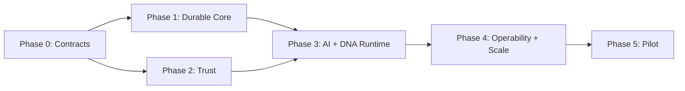

# Prioritized Implementation Roadmap

## Delivery Rule

Preserve the current guided journey behind compatibility contracts while replacing browser/process-local execution incrementally. Each phase has a go/no-go gate; dates are planning ranges, not commitments.

## Phase 0 — Contracts and Stabilization (2–4 weeks)

**Outcome:** A tested seam between product experience and runtime.

- Approve state ownership, IDs, event envelope, risk classes, and tenant boundary.
- Inventory current state transitions, work objects, artifacts, and guided-demo contracts.
- Define API/command/query schemas and compatibility adapter.
- Baseline current journey, accessibility, responsive, and deterministic tests.
- Establish threat model, data classification, service ownership, and ADR review.

**Gate:** Existing V1.3 journey passes unchanged through the contract test harness; no duplicate state owner is introduced.

## Phase 1 — Durable Runtime Core (6–8 weeks)

**Outcome:** One low-risk journey survives process failure.

- Implement tenant-scoped workflow store, state versioning, checkpoints, and outbox.
- Add durable task queue, leases, retries, idempotency, and effect registry.
- Add immutable artifact/evidence storage and metadata.
- Implement pause/resume/cancel and session recovery.
- Instrument baseline traces, metrics, and structured logs.
- Migrate one guided path behind a feature flag; retain deterministic fallback.

**Gate:** Fault tests prove no lost acknowledged transition or duplicate effect; rollback restores the existing journey.

## Phase 2 — Trust Foundation (6–8 weeks, overlaps after Phase 1 contracts)

**Outcome:** Authenticated, tenant-isolated, policy-controlled execution.

- Federated identity, MFA integration, workload identity, tenant provisioning.
- Authorization/policy service and enforcement points.
- Approval service bound to action/evidence hashes.
- Secret/key management, data classification, audit ledger.
- Tenant-isolation, policy, approval-bypass, and break-glass tests.

**Gate:** Independent security review finds no critical tenant/control bypass; governed mutations fail closed.

## Phase 3 — Enterprise DNA, Context, Model, and Tool Runtime (8–12 weeks)

**Outcome:** Agents reason from governed evidence and act only through controlled adapters.

- Production Enterprise DNA entity/relationship authority and snapshots.
- Evidence ingestion, provenance, confidence calculation, and stewardship promotion.
- Context assembly and scoped memory with injection/taint defenses.
- Provider-agnostic model gateway with routing, budgets, fallback, and evaluation.
- Typed tool gateway, sandbox, capability tokens, and reconciliation.
- Agent runtime with bounded tasks, specialist contracts, and handoffs.

**Gate:** Representative journey demonstrates reproducible DNA snapshot, traceable evidence, safe provider failure, and no direct model/tool credential access.

## Phase 4 — Operations, Resilience, and Scale (8–12 weeks)

**Outcome:** A service that can be responsibly operated.

- Multi-zone deployment, autoscaling, bulkheads, fair queues, and quotas.
- SLOs/error budgets, synthetic journeys, dashboards, alerts, and runbooks.
- Progressive delivery, signed supply chain, configuration and prompt/policy promotion.
- Backup/restore, regional failover rehearsal, and workflow reconciliation.
- Load, soak, chaos, cost, accessibility, and cross-tenant tests.

**Gate:** SLO budgets pass at 2x planned pilot load with zone/provider failure; restore and incident game day meet objectives.

## Phase 5 — Controlled Production Pilot (4–8 weeks)

**Outcome:** Bounded enterprise validation with explicit operational support.

- Select synthetic/non-production or carefully classified tenant workloads.
- Limit workflows, tools, models, data classes, and side-effect risk.
- Staff on-call and daily reliability/security review.
- Measure outcome quality, confidence calibration, user trust, latency, cost, and failures.
- Close critical findings before broader availability.

**Gate:** Product, Security, SRE, Data Governance, and accountable business owner approve expansion using pilot evidence.

## Dependency Order

## Highest-Priority Backlog

1. Tenant and state ownership contracts.
2. Durable workflow/checkpoint proof of concept.
3. Identity, authorization, audit, and approval threat model/prototype.
4. Evidence and Enterprise DNA snapshot contract.
5. Model/tool gateway contract with deterministic fallback.
6. End-to-end telemetry and synthetic journey.
7. Recovery, scale, and operational validation.

## Explicit Deferrals

- Broad autonomous production changes.
- Active/active multi-region writes.
- Universal graph database adoption.
- Kubernetes/service mesh without measured need.
- Large marketplace of arbitrary agents/tools.
- Self-modifying policies, prompts, or agent definitions.
- Enterprise data ingestion beyond governed pilot connectors.
